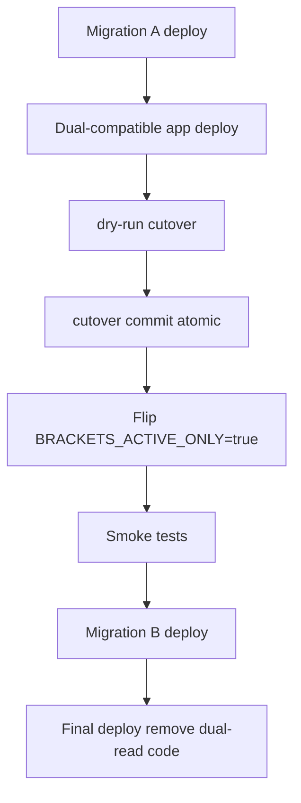

# Bracket ACTIVE singleton cutover runbook (plan v7)

Phased rollout from legacy DRAFT/PUBLISHED to a single `ACTIVE` generation with `singletonKey='live'`.

## Prerequisites

- Migration A applied (`20260926120000_bracket_active_migration_a`)
- Dual-compatible app deployed (reads ACTIVE if present, else legacy DRAFT/PUBLISHED)
- Database backup taken (`deploy/backup-postgres.sh` on VPS)
- Ops window scheduled; write traffic will pause

## Rollout order



| Step | Action | Notes |
|------|--------|-------|
| 1 | `prisma migrate deploy` through Migration A | Schema expansion only |
| 2 | Deploy dual-compatible app | All instances on new code before cutover |
| 3 | Enable maintenance / drain writes | No ordinary bracket mutations during cutover |
| 4 | Dry-run | `npm run brackets:cutover -- --dry-run` |
| 5 | Cutover commit | `npm run brackets:cutover -- --commit` |
| 6 | Keep traffic paused | Gap rule: no writes until flag flip + smoke |
| 7 | Flip runtime flag | `BRACKETS_ACTIVE_ONLY=true` on all instances |
| 8 | Smoke | Public `/brackets`, `/bouts`, admin dashboard |
| 9 | Resume traffic | ACTIVE-only path only |
| 10 | Migration B | `20260926130000_bracket_active_migration_b` |
| 11 | Final deploy | Remove dual-read / legacy enum code paths |

**Alternative:** steps 7–11 in one extended maintenance window (zero traffic) if preferred.

## Maintenance window traffic rules

| Phase | Write traffic |
|-------|---------------|
| Before cutover commit | **Paused** |
| Cutover commit (steps 2–8) | **Paused** — cutover script only |
| After commit, before `BRACKETS_ACTIVE_ONLY=true` | **Paused** — dual app must not write legacy DRAFT/PUBLISHED |
| Flag flip + smoke | Read-only smoke, then controlled write test |
| After smoke OK | **Resume** on ACTIVE-only path |
| Migration B + final deploy | Paused or ACTIVE-only traffic only |

Checklist: `[ ] maintenance ON → cutover → flag flip → smoke → maintenance OFF`

## Commands

### Dry-run (step 1 — read-only report)

```bash
npm run brackets:cutover -- --dry-run
```

Reports DRAFT/PUBLISHED/ACTIVE counts, chosen live source, OPEN draft categories to merge, and publication pointer health.

### Cutover commit (steps 2–8)

**Preferred — single Serializable transaction:**

```bash
npm run brackets:cutover -- --commit
```

**Fallback — idempotent checkpoint path** (validate on staging first):

```bash
npm run brackets:cutover -- --commit --use-checkpoint
```

Uses `BracketCutoverCheckpoint` to resume from the last completed phase if the primary transaction path fails (timeout/size).

### Post-cutover verification

```bash
# Expect exactly one ACTIVE row
psql "$DATABASE_URL" -c "SELECT COUNT(*) FROM \"BracketGeneration\" WHERE status = 'ACTIVE' AND \"singletonKey\" = 'live';"

npm run brackets:reconcile-publication
```

Set `BRACKETS_ACTIVE_ONLY=true`, restart app instances, run smoke tests, then deploy Migration B.

## Cutover script steps (2–8)

| Step | Action |
|------|--------|
| 2 | Choose liveSource — prefer PUBLISHED, else DRAFT |
| 3 | Promote liveSource → `ACTIVE`, `singletonKey='live'` |
| 4 | Merge OPEN categories from DRAFT when liveSource was PUBLISHED |
| 5 | Rebind all `BracketPublicationState.publishedDrawId` to ACTIVE draws |
| 6 | Verify pointers resolve |
| 7 | Assert `COUNT(ACTIVE, singletonKey='live') = 1` |
| 8 | Delete legacy DRAFT/PUBLISHED generations |

Any failure in the primary transaction rolls back to pre-cutover state.

## Migration B

Run **only after**:

- Cutover commit succeeded
- `BRACKETS_ACTIVE_ONLY=true` deployed and smoke-tested
- No running code reads/writes `DRAFT`/`PUBLISHED`

Migration B recreates `BracketGenerationStatus` as ACTIVE-only and sets `singletonKey NOT NULL DEFAULT 'live'`.

## Rollback

- **Before cutover commit:** disable maintenance; no data change
- **Failed cutover transaction:** automatic DB rollback; investigate and retry dry-run
- **After successful cutover:** rollback requires DB restore from pre-cutover backup — not a code rollback alone

## Code rules (frozen v7)

- Migration B never runs while dual-read traffic is active (unless full maintenance mode)
- No deploy that only reads DRAFT/PUBLISHED after `BRACKETS_ACTIVE_ONLY=true`
- Prefer single transaction cutover; checkpoint path requires staging validation
